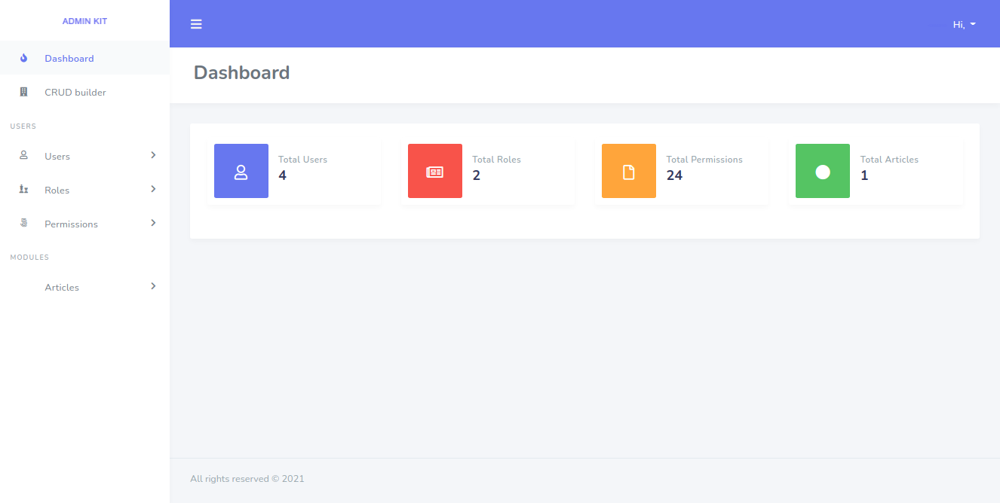

# adminkit
laravel starter project

## usage
[documentation coming soon](#)

## installation
```bash
git clone git@github.com:abdallhsamy/adminkit.git
```
```bash
cd adminkit
```
```bash
composer install --ignore-platform-reqs 
```
```bash
npm install
```
```bash
npm run dev
```
```bash
cp .env.example .env
```

[comment]: <> (- add your database credentials)

[comment]: <> (```bash)

[comment]: <> (php artisan admin:install)

[comment]: <> (```)

## TODO:
- [ ] modularity system
- [ ] crud generator
- [ ] user manager
- [ ] social login
- [ ] 2FA
- [ ] user profile
- [ ] permission manager
- [ ] awosome UI
- [ ] dynamic menu
- [ ] log viewer
- [ ] user activity log
- [ ] env editor
- [ ] system settings
- [ ] dockerize app
- [ ] API crud generator
- [ ] heath monitor
- [ ] auto system backup
- [ ] multi theme support
- [ ] media file manager
- [ ] saas support with tenancy
- [ ] newsletter
- [ ] widget manager
- [ ] chart generator
- [ ] auto updater from repo
- [ ] realtime user chat
- [ ] system email viewer
- [ ] visit log
- [ ] analytics
- [ ] login as another user (for supper admins  | impersonate user :D)

### phase one todo
- [ ] Users
- [ ] Users CRUD
- [ ] User Registration
- [ ] User Login
- [ ] User Activation
- [ ] Reset Password
- [ ] Account Approval
- [ ] Two Factor Authentication
- [ ] Social Login
- [ ] Email Verfication
- [ ] Create User
- [ ] Set User Role
- [ ] Activate or Deactivate User
- [ ] Delete User
- [ ] Update User Information
- [ ] Change Password
- [ ] User Avatar
- [ ] Auto and Manual Screen Lock
- [ ] Notifications System
- [ ] User Role & Permission Management (ACL) System
- [ ] Multi-lingual & Locale Management
- [ ] Print & Export Functionality
- [ ] Press Any Key to Search
- [ ] Maintenance Mode

- [ ] Design Highlights
- [ ] Mobile Responsive Design
- [ ] Full Screen Mode
- [ ] Multiple Color Scheme
- [ ] Multiple Styling Options
- [ ] Configurable UI Variables
- [ ] Prebuilt Form Components
- [ ] File Uploader
- [ ] Image Uploader
- [ ] Date Picker
- [ ] Date Range Picker
- [ ] Date Time Picker
- [ ] Animated Loader


## screenshots



